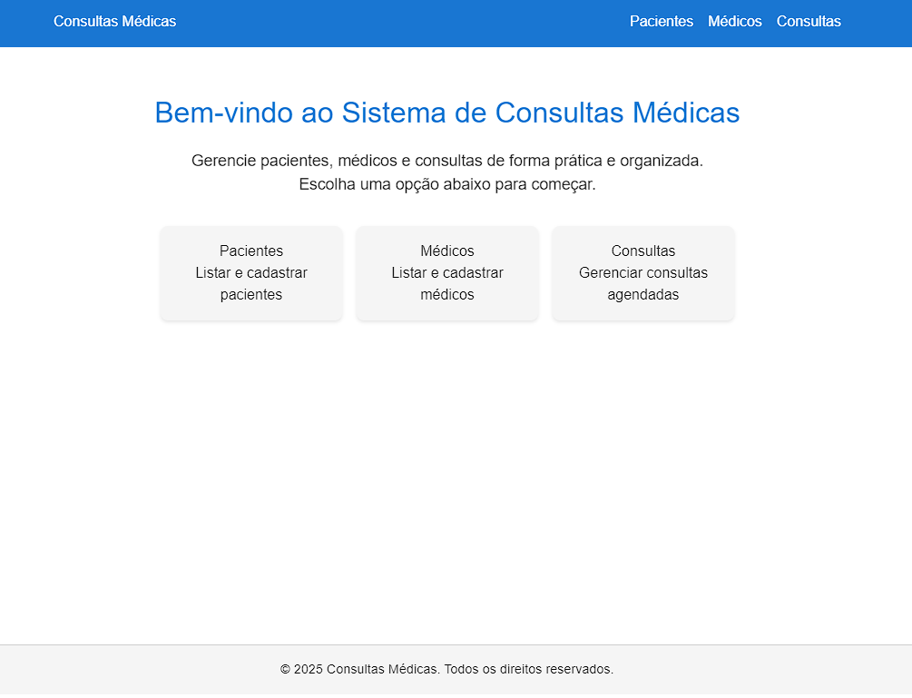
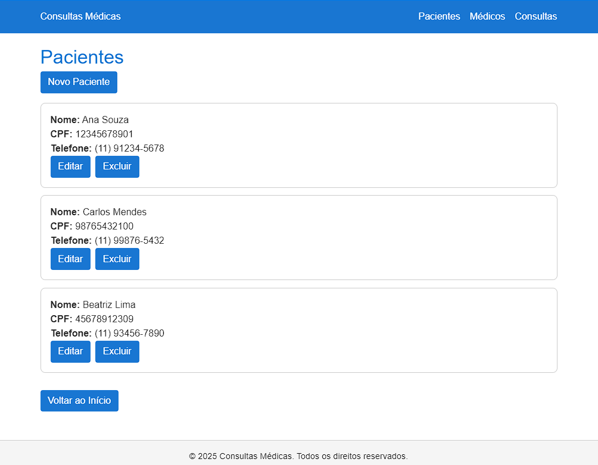
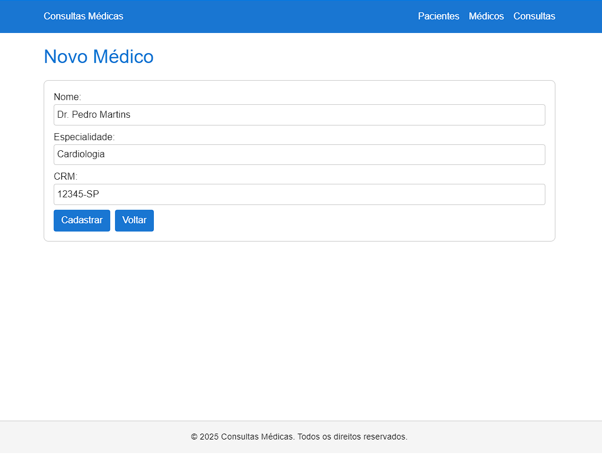
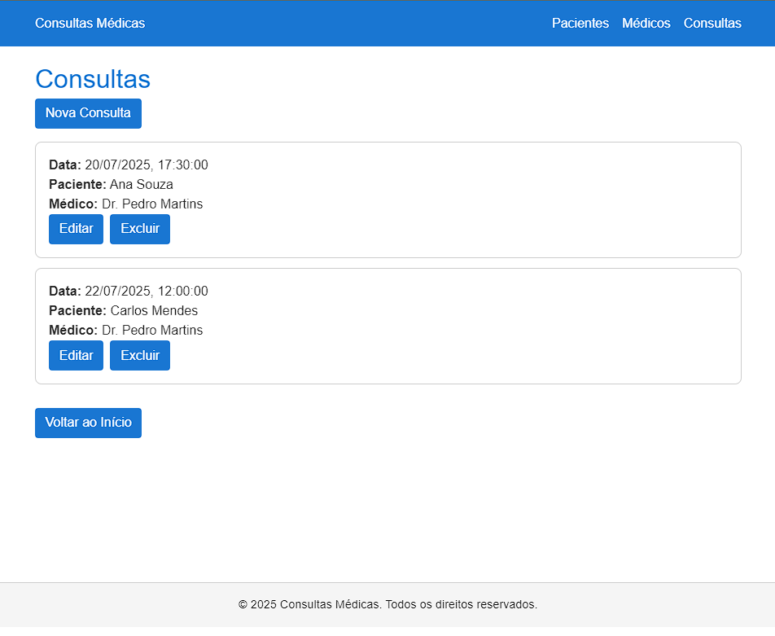

# 🩺 Sistema de Consultas Médicas
Este projeto full stack foi desenvolvido utilizando Next.js + React no front-end e Nest.js + Prisma ORM no back-end. O sistema gerencia pacientes, médicos e consultas, permitindo cadastrar, listar, editar e excluir registros de forma prática e organizada.

## Funcionalidades

### 🙍‍♂️ Módulo Pacientes
- Cadastro de pacientes
- Listagem de todos os pacientes registrados
- Edição de dados dos pacientes
- Exclusão de pacientes

### 👨‍⚕️ Módulo Médicos
- Cadastro de médicos com especialidade e CRM
- Listagem de médicos
- Edição de informações de médicos
- Exclusão de médicos

### 📅 Módulo Consultas
- Cadastro de consultas vinculando paciente e médico
- Listagem de todas as consultas com data formatada para BR
- Edição de consultas agendadas
- Exclusão de consultas

## 🧱 Tecnologias Utilizadas

| Camada         | Tecnologias                        |
| :------------- | :--------------------------------- |
| **Front-end** | React, Next.js e Axios |
| **Back-end** | Nest.js, TypeScript e Prisma ORM    |
| **Base de Dados**| SQLite (para desenvolvimento)   |
| **Estilização**| Tailwind CSS                       |

## 🗃️ Modelagem de Dados

### Paciente
- id: identificador único (Primary Key)
- nome: nome do paciente
- cpf: CPF do paciente
- telefone: telefone de contato

### Médico
- id: identificador único (Primary Key)
- nome: nome do médico
- especialidade: área de especialidade
- crm: registro profissional

### Consulta
- id: identificador único (Primary Key)
- dataConsulta: data e hora agendada
- observacoes: informações adicionais
- pacienteId: referência ao paciente (Foreign Key)
- medicoId: referência ao médico (Foreign Key)

## 🚀 Como Executar o Projeto

Para executar o projeto, será necessário de dois terminais abertos: um para o back-end e outro para o front-end.

### 📦 Backend

No primeiro terminal, navegue até a pasta backend:

```bash
cd backend # Navegue até a pasta do backend

npm install # Instale as dependências

npx prisma migrate dev # Execute as migrations do Prisma para criar o banco e tabelas

npm run start:dev # Inicie o servidor de desenvolvimento
```
A API do back-end rodará em `http://localhost:3002`.

### 💻 Frontend

Em um segundo terminal, navegue até a pasta frontend:

```bash
cd frontend # Navegue até a pasta do frontend

npm install # Instale as dependências

npm run dev # Inicie o servidor de desenvolvimento
```
A aplicação front-end estará acessível em `http://localhost:3000`.

## 📸 Screenshots

- Página inicial


- Listagem de pacientes


- Cadastro de médicos


- Agendamento de consultas

